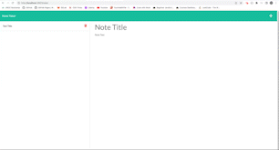
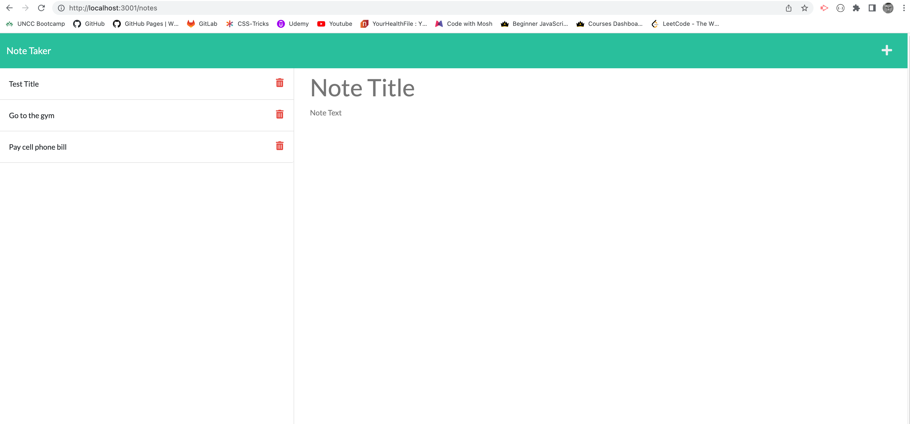

# Note Taker

A note taker app where the user can write, save and delete notes. You can organize thoughts and keep track of tasks you need to complete.

When you launch the app you are taken to a landing page that links to the Note Taker page. You have saved notes in the left-hand column, plus empty fields to enter a new note title and the note's text in the right-hand column.

When you enter a new note title and note's text a Save icon appears in the navigation at the top of the page. When you click the Save icon the new note will be saved and appears in the left-hand column with the other saved notes.

When you click on a saved note in the list in the left-hand column, that note appears in the right-hand column.

When you click on the Write icon in the navigation at the top of the page, you will be presented with empty fields to enter a new note title and the note's text in the right-hand column.

When you click on the trash can icon in the left-hand column, it will delete the saved note.

### Languages and Tools:

  

## GitHub repository for challenge 11

-   [Github Repo](https://github.com/joliver521/note-taker)

## Live website for challenge 11

-   [Heroku Deployed Live App](https://powerful-gorge-19881.herokuapp.com/notes)
